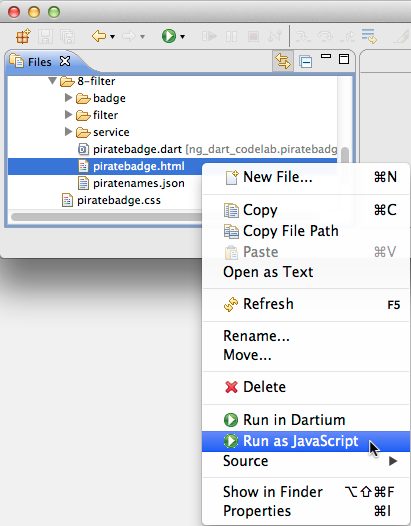
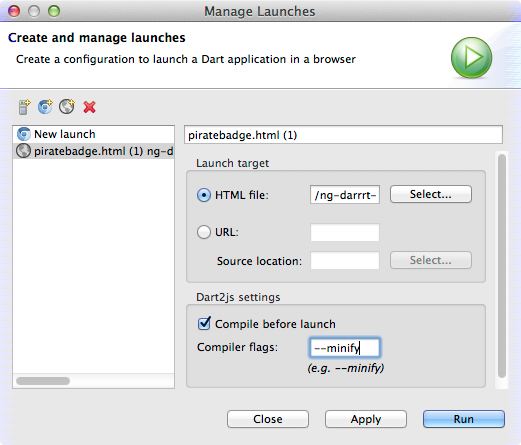

## Step 9: Run the app as JavaScript

In this step, you compile the app to JavaScript and
run it in the modern browser of your choice.

_**Keywords**: dart2js, minification_

Once you're ready to test your app in a non-Dartium browser,
you need to compile your app to JavaScript.
Before deploying your app, you might also want to minify its JavaScript.

**Note:** AngularDart currently produces large JavaScript.
_[PENDING: perhaps explain more, definitely link to bugs to follow]_

### Run the app as JavaScript.

**&rarr; In Dart Editor, right-click the HTML file and choose Run as JavaScript.**

For example, go to **web/8-filter/piratebadge.html**,
right-click it, and choose **Run as JavaScript**.

At the lower right of Dart Editor is a progress bar
telling you the status of the build,
which might take 15 or 20.
You might also see many warnings in an Output pane;
as long as your app eventually comes up,
you can ignore the warnings.

Once Dart Editor compiles your file,
it brings up the app in your default browser
(for example, Chrome).

### Run the app in another browser.

Copy the app's URL from your default browser,
and paste it into another browser,
such as Safari or Firefox.

### Minify the JavaScript

To reduce the size of the generated JavaScript by half or more,
you can minify the JavaScript.
_Minification_ is the process of removing all unnecessary characters from source code.
In the future, you'll be able to use the `pub build` command,
which automatically minifies the output.
Unfortunately `pub build`
doesn't yet work with the code lab samples,
so this section has a workaround.

<b> &rarr; In Dart Editor's menu, choose Run > Manage Launches. </b>

Alternatively, click the little arrow to the right of the Run button,
and then choose **Manage Launches**.

<b> &rarr; Choose the JavaScript launch configuration. </b>

Click the launch configuration to choose it.
The launch configuration should have a gray world icon,
and its target should be the HTML file for the app.

If you can't decide on the right launch configuration,
try this trick:
Delete all the launch configurations
that you didn't explicitly create or edit
(select them all, and click the red X).
Then run the app as JavaScript again,
and return to this dialog.
Now click the only launch configuration in the list.

<b> &rarr; Add the --minify compiler flag. </b>

Add **--minify** to the **Dart2js settings** section's **Compiler flags** field.

<b> &rarr; Click the Run button. </b>

Like before, you'll see a status message.
Soon, the app will appear in your default browser.

## What next?

_[PENDING: link to what to do next: tutorial, ...]_

## [Home](../README.md) | [< Previous](step-8.md)
